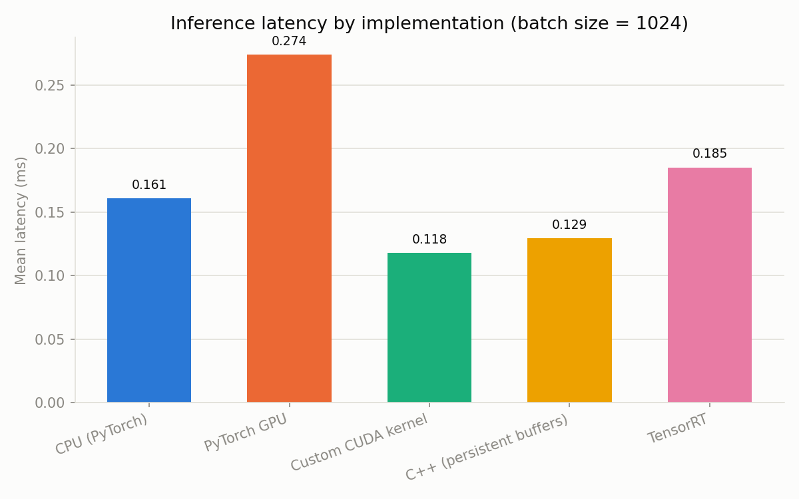
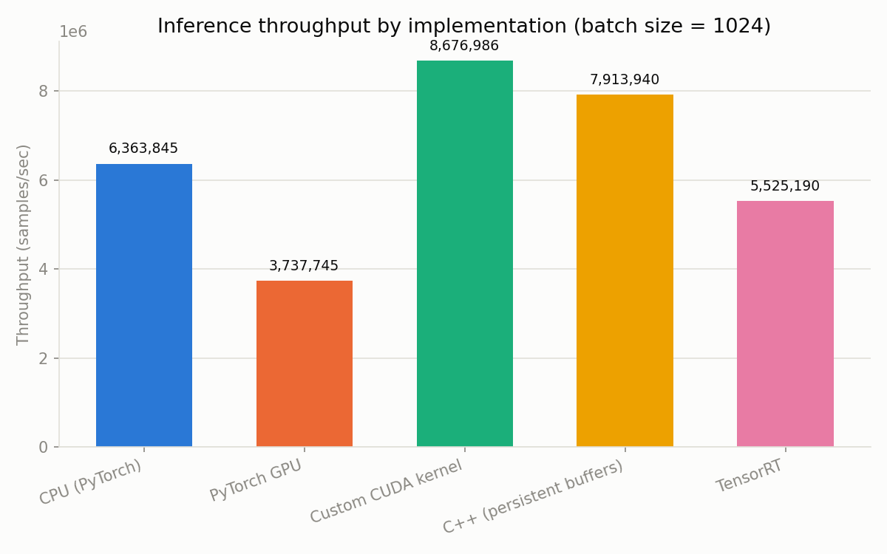
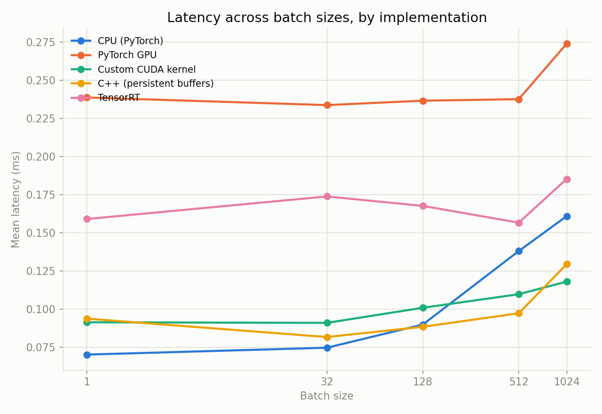

# GPU-Accelerated Fraud Detection

An end-to-end credit-card fraud detection system built to demonstrate the real engineering progression from a CPU baseline to GPU-accelerated inference: **Python/CPU → PyTorch GPU → custom CUDA kernel → C++ inference → TensorRT → containerized API.**

This is a portfolio/learning project, not a production system. The goal is a working, benchmarked, reproducible pipeline — not inflated performance claims. Every number in this README is generated by a script in this repo; none are hand-typed.

**Status: all 15 phases complete**, plus a web demo frontend, terminal demo/environment-check/verification scripts, and auto-generated benchmark plots. This README documents what was actually built and measured, not a plan.

## Hardware / software environment

| | |
|---|---|
| GPU | NVIDIA GeForce RTX 3060 Laptop, 6GB VRAM |
| CPU | Intel Core i7-11800H |
| OS | Windows 11 (host), WSL2/Ubuntu for GPU/CUDA/C++/TensorRT/Docker phases |
| Python | 3.13 (host), 3.10 (WSL2 CUDA environment) |

See [Environment Notes](#environment-notes) below for why WSL2 was needed for the GPU phases and how the driver/toolchain compatibility issues were actually resolved.

## Repository structure

```
fraud-detection/
├── Dockerfile, docker-compose.yml, .dockerignore   # Phase 10
├── requirements.txt            # .venv (Windows, CPU) -- also the WSL2 base
├── requirements-gpu.txt        # .venv-gpu (Windows, CUDA 11.3 torch)
├── requirements-wsl-cuda.txt   # ~/venv-cuda (WSL2, full stack)
│
├── data/
│   ├── README.md        # dataset source, license, fetch instructions
│   └── samples/          # real labeled fixtures reused across C++/API/TensorRT/frontend tests
├── src/
│   ├── data/             # preprocessing.py, dataset.py
│   ├── models/           # model.py, train.py
│   ├── inference/        # cpu_inference.py, pytorch_gpu.py, custom_cuda.py, benchmark.py
│   └── api/               # server.py (FastAPI)
├── cuda/                   # Phase 6: fraud_kernel.cu(h), torch_binding.cpp, CMakeLists.txt
├── cpp/                     # Phase 7: inference.hpp/cpp, main.cpp, test_predictor.cpp, CMakeLists.txt
├── tensorrt/                 # Phase 8: export_model.py, build_engine.py, inference.py
├── frontend/                  # web demo (served by src/api/server.py)
├── tests/                      # pytest suite (68 tests; GPU/CUDA-specific ones skip cleanly without a GPU)
├── benchmarks/                  # benchmark_*.py, profile_pipeline.py, plot_results.py, results/*.json + figures/
├── scripts/                      # fetch/inspect/export/check_environment/demo/verify
└── docs/                          # per-phase deep-dive writeups (bottleneck analysis, CUDA kernel, C++, TensorRT, Docker)
```

## Dataset

[Credit Card Fraud Detection](https://www.kaggle.com/datasets/mlg-ulb/creditcardfraud) (ULB Machine Learning Group) — European cardholder transactions, September 2013. Fetched via OpenML (no auth required) rather than committed to the repo. See [data/README.md](data/README.md) for full details.

**Actual measured characteristics:**

| Metric | Value |
|---|---|
| Total transactions | 284,807 |
| Fraudulent transactions | 492 (0.173%) |
| Class imbalance | 1 : 577.9 |
| Features | 29 (V1–V28 PCA components, Amount) |
| Missing values | 0 |
| Duplicate rows (dropped during preprocessing) | 9,144 |

## Preprocessing

`src/data/preprocessing.py` — schema validation, duplicate removal, deterministic (seed=42) stratified train/val/test split (70/15/15), `Amount` scaled with a `StandardScaler` fit on the train split only (no leakage). Verified by 11 tests in `tests/test_preprocessing.py` covering schema rejection, missing-value imputation, split determinism, split disjointness, and leakage-free scaling.

```bash
python scripts/fetch_dataset.py       # download raw data
python scripts/inspect_dataset.py     # print dataset statistics
python -m src.data.preprocessing      # produce train/val/test splits
pytest tests/test_preprocessing.py -v # 11 passed
```

Resulting split sizes (from the actual run, seed=42):

| Split | Rows | Fraud | Fraud % |
|---|---|---|---|
| train | 192,963 | 331 | 0.1715% |
| val | 41,350 | 71 | 0.1717% |
| test | 41,350 | 71 | 0.1717% |

## Model

`src/models/model.py` — a deliberately small MLP (29 → 64 → 32 → 1, 4,033 parameters). The engineering focus of this project is the inference pipeline (CPU → GPU → CUDA → C++ → TensorRT), not squeezing out accuracy with a larger network — a small model keeps every downstream port (CUDA kernel, C++ rewrite, TensorRT export) tractable to implement and verify correctly.

`src/models/train.py` — trains with `BCEWithLogitsLoss` and a `pos_weight` computed from the actual train-split class ratio (582:1) to counter the imbalance, rather than resampling. Accuracy is not used as a metric — see the module docstring for why (with 0.17% fraud, "always predict legitimate" scores 99.83% accuracy while catching zero fraud).

**Why report two thresholds:** the aggressive `pos_weight` pushes predicted probabilities toward the extremes, so the default 0.5 cutoff is a poor decision boundary. The threshold is instead *tuned on the validation set* (maximizing F1) and then applied, unmodified, to the held-out test set — the test set is never used for model or threshold selection.

**Actual results (seed=42, 20 epochs, CPU, run 2026-08-20):**

| Metric | @ threshold=0.5 | @ threshold=0.999 (tuned on val) |
|---|---|---|
| Precision | 0.143 | 0.828 |
| Recall | 0.901 | 0.746 |
| F1 | 0.247 | **0.785** |
| ROC-AUC | 0.974 | 0.974 (threshold-independent) |
| PR-AUC | 0.692 | 0.692 (threshold-independent) |
| Confusion matrix (TN/FP/FN/TP) | 40895 / 384 / 7 / 64 | 41268 / 11 / 18 / 53 |

Test set: 41,350 transactions, 71 fraud. Full per-epoch history and both threshold evaluations are saved to `models/checkpoints/training_results.json` on every training run (not hand-typed).

```bash
python -m src.models.train --epochs 20 --batch-size 256 --device cpu
pytest tests/test_model.py -v   # 12 passed
```

## CPU inference baseline

`src/inference/cpu_inference.py` — loads the trained checkpoint + its val-tuned decision threshold and exposes `predict(x) -> {fraud_probability, is_fraud}`. This is the baseline every later backend (PyTorch GPU, custom CUDA, C++, TensorRT) is compared against, so `src/inference/benchmark.py` — the shared harness — is built to be reused unchanged for all of them: warm-up iterations before timing, `torch.cuda.synchronize()` around the timed region whenever the device is CUDA (a no-op here on CPU, load-bearing from Phase 4 onward), and per-call latency samples so P95/P99 are real percentiles, not just an average.

**Actual results** (RTX 3060 laptop's host CPU: i7-11800H, 8 threads, 20 warm-up + 200 measured iterations per batch size, run 2026-08-20):

| Batch size | Mean (ms) | Median (ms) | P95 (ms) | P99 (ms) | Throughput (samples/s) |
|---:|---:|---:|---:|---:|---:|
| 1 | 0.070 | 0.066 | 0.083 | 0.129 | 14,268 |
| 32 | 0.075 | 0.072 | 0.089 | 0.101 | 429,024 |
| 128 | 0.090 | 0.082 | 0.138 | 0.190 | 1,425,691 |
| 512 | 0.138 | 0.130 | 0.183 | 0.265 | 3,711,180 |
| 1024 | 0.161 | 0.144 | 0.249 | 0.384 | 6,363,845 |

Raw data: `benchmarks/results/cpu_results.json` (generated by the script, not hand-typed). The takeaway: with a 4,033-parameter model, per-call Python/dispatch overhead dominates at small batches — latency barely grows from batch 1 to 1024 (0.07ms → 0.16ms), so throughput scales almost linearly with batch size. This sets up the actual question for Phase 5: is there a real bottleneck worth optimizing with CUDA here, or is a model this small already dispatch-bound rather than compute-bound? That's investigated directly rather than assumed.

```bash
python benchmarks/benchmark_cpu.py
pytest tests/test_inference.py -v   # 7 passed
```

## PyTorch GPU inference

`src/inference/pytorch_gpu.py` — the GPU counterpart to `cpu_inference.py`, same `predict()` interface, model moved to `cuda`, inference wrapped in `torch.inference_mode()`-equivalent (`@torch.no_grad()`), benchmark timing wrapped with `torch.cuda.synchronize()` so async kernel launches are actually measured rather than just their dispatch.

**Environment resolution (see [Environment notes](#environment-notes) below for the full story):** the installed driver caps CUDA at 11.4, incompatible with the CUDA 12.x builds current PyTorch/Python 3.13 require. Rather than block on a driver update, GPU work runs in a second venv, `.venv-gpu` (Python 3.10, installed at user scope via `winget --scope user` — no admin needed), with `torch==1.12.1+cu113`, whose CUDA 11.3 runtime the current driver actually supports. Model checkpoints are saved as plain `state_dict` tensors, so the exact same `fraud_mlp.pt` trained under torch 2.13/CPU loads and runs correctly under torch 1.12/CUDA — verified by `tests/test_gpu_inference.py::test_gpu_and_cpu_agree_numerically`, which checks CPU and GPU produce numerically equivalent probabilities on identical weights/inputs (`atol=1e-5`).

```
Device: NVIDIA GeForce RTX 3060 Laptop GPU
torch 1.12.1+cu113 (CUDA 11.3), VRAM 6.44GB, compute capability 8.6
```

**Actual results** (same batch sizes, warm-up, and iteration counts as the CPU baseline; run 2026-08-20):

| Batch size | Mean GPU (ms) | Mean CPU (ms) | GPU vs CPU |
|---:|---:|---:|---:|
| 1 | 0.239 | 0.070 | **3.4x slower** |
| 32 | 0.234 | 0.075 | **3.1x slower** |
| 128 | 0.237 | 0.090 | **2.6x slower** |
| 512 | 0.238 | 0.138 | **1.7x slower** |
| 1024 | 0.274 | 0.161 | **1.7x slower** |

**Honest finding, not the one you'd expect going in: the GPU is slower than the CPU at every batch size tested.** At 4,033 parameters, the model's actual compute is trivial — kernel launch overhead and host↔device transfer dominate the GPU's wall-clock time, and that fixed overhead is never amortized away because there isn't enough work per call to hide it behind. This is a legitimate, common result for small tabular models and is exactly why Phase 5 investigates the pipeline stage-by-stage before writing a custom CUDA kernel, rather than assuming GPU=faster and looking for a kernel to write.

Raw data: `benchmarks/results/gpu_results.json`.

```bash
py -3.10 -m venv .venv-gpu
.venv-gpu\Scripts\pip install -r requirements-gpu.txt --index-url https://download.pytorch.org/whl/cu113 --extra-index-url https://pypi.org/simple
.venv-gpu\Scripts\python benchmarks\benchmark_gpu.py
.venv-gpu\Scripts\python -m pytest tests\test_gpu_inference.py -v   # 5 passed
```

## Bottleneck analysis (Phase 5)

Before writing a custom CUDA kernel, `benchmarks/profile_pipeline.py` measures where the GPU pipeline actually spends time — host tensor prep, H2D transfer, GPU compute, D2H transfer, postprocessing — each stage isolated with `torch.cuda.synchronize()` boundaries so async GPU work can't leak into the wrong measurement.

**Finding:** `gpu_compute` (the model's forward pass) consumes ~70-73% of total pipeline time at every batch size, and — the key signal — that time is nearly **flat** regardless of batch size (0.206ms at batch=32 vs 0.231ms at batch=1024, an 11% increase for a 32x larger batch). Real compute-bound work scales with data size; this doesn't. That's the signature of fixed **kernel launch overhead**, not arithmetic throughput: `FraudMLP.forward()` dispatches ~6 separate CUDA kernels (3x Linear/GEMM, 2x ReLU, 1x sigmoid), each paying fixed microsecond-scale dispatch latency that swamps the actual FLOPs for matrices this small (29x64, 64x32, 32x1).

Full writeup, table, and reasoning: [docs/bottleneck_analysis.md](docs/bottleneck_analysis.md).

**Conclusion driving Phase 6:** fusing the 3-layer MLP forward pass into a single custom CUDA kernel replaces ~6 kernel launches with 1, directly targeting the ~70% of pipeline time this phase measured as launch-overhead-bound — a real, measured justification for the kernel, not one written to justify writing a kernel. Whether the fused kernel actually wins is what Phase 6 tests, not what this phase assumes.

```bash
.venv-gpu\Scripts\python benchmarks\profile_pipeline.py
.venv-gpu\Scripts\python -m pytest tests\test_profiling.py -v   # 3 passed
```

**Note on running tests under `.venv-gpu`:** it's a deliberately minimal environment (no pandas/sklearn — see `requirements-gpu.txt`), so only run the GPU-specific files there (`tests\test_gpu_inference.py`, `tests\test_profiling.py`), not the full `tests/` tree. The full suite runs under `.venv`.

## Custom CUDA kernel (Phase 6)

`cuda/fraud_kernel.cu` fuses the model's entire 3-layer forward pass (Linear→ReLU→Linear→ReLU→Linear→sigmoid) into a **single** CUDA kernel launch, directly targeting the ~70% launch-overhead cost Phase 5 measured — one thread per transaction, since the per-sample compute is trivial and the real win is eliminating ~6 separate PyTorch kernel dispatches per call. Full design writeup (grid/block config, memory access pattern, why no shared memory, synchronization): [docs/custom_cuda_kernel.md](docs/custom_cuda_kernel.md).

**Correctness:** validated two independent ways — a standalone C++/CUDA test (`cuda/kernel_correctness_test.cu`, max abs diff 4.2e-7 vs a plain-C++ reference) and 9 pytest tests (`tests/test_custom_cuda.py`) comparing the PyTorch-extension-wrapped kernel against a CPU `FraudMLP` with identical weights across all 5 batch sizes. All pass.

**Actual measured results** (same harness/methodology as Phases 3-4):

| Batch | CPU | PyTorch GPU | **Custom kernel** | vs PyTorch GPU | vs CPU |
|---:|---:|---:|---:|---:|---:|
| 1 | 0.070 ms | 0.239 ms | 0.091 ms | 2.6x faster | 1.3x slower |
| 32 | 0.075 ms | 0.234 ms | 0.091 ms | 2.6x faster | 1.2x slower |
| 128 | 0.090 ms | 0.237 ms | 0.101 ms | 2.3x faster | 1.1x slower |
| 512 | 0.138 ms | 0.238 ms | 0.110 ms | 2.2x faster | **1.3x faster** |
| 1024 | 0.161 ms | 0.274 ms | 0.118 ms | 2.3x faster | **1.4x faster** |

**Honest result:** the kernel decisively beats PyTorch's own GPU dispatch at every batch size (confirming Phase 5's diagnosis), but only beats the CPU baseline at batch≥512 — there's a real crossover, not a uniform GPU win. Reported as measured; see docs/custom_cuda_kernel.md for the full reasoning.

```bash
# Inside WSL2 (see Environment notes below for why):
source ~/venv-cuda/bin/activate
python -m pytest tests/test_custom_cuda.py -v          # 9 passed
python benchmarks/benchmark_custom_cuda.py

# Standalone C++/CUDA correctness+timing test (no PyTorch):
cp -r cuda ~/cuda_build && cd ~/cuda_build             # build off /mnt/c (see note below)
cmake -S . -B build -DCMAKE_CUDA_HOST_COMPILER=/usr/bin/g++-10
cmake --build build
./build/kernel_correctness_test /mnt/c/Users/Aayush/fraud-detection/models/exported
```

## C++ inference component (Phase 7)

`cpp/inference.cpp`'s `FraudPredictor` is a real inference engine, not a Python wrapper: no libtorch/PyTorch dependency anywhere in the call path. It reads the exported raw weight binaries, uploads them to the GPU exactly once at construction, and reuses persistent input/output device buffers across calls (growing only on demand) — a genuine architectural difference from Phase 6's PyTorch extension, which re-wraps a `torch::Tensor` on every call. It calls `cuda/fraud_kernel.cu`'s kernel directly. Full design + validation writeup: [docs/cpp_inference.md](docs/cpp_inference.md).

**Correctness:** `cpp/test_predictor.cpp` — input validation (wrong feature count → `std::invalid_argument`), missing-weights handling (→ `std::runtime_error`), and **10/10 real held-out labeled transactions classified correctly**. All pass.

**Actual measured results** (same batch sizes/methodology as every other backend):

| Batch | CPU | PyTorch GPU | Custom kernel (PyTorch ext.) | **C++ (persistent buffers)** |
|---:|---:|---:|---:|---:|
| 1 | 0.070 ms | 0.239 ms | 0.091 ms | 0.094 ms |
| 128 | 0.090 ms | 0.237 ms | 0.101 ms | 0.088 ms |
| 1024 | 0.161 ms | 0.274 ms | 0.118 ms | 0.129 ms |

**Honest result:** comparable to, and modestly faster than, the PyTorch-extension kernel at batch 32-512 (consistent with shedding Python/PyTorch dispatch overhead) — but not uniformly faster (slower at batch=1024, most plausibly measurement noise since both paths call the identical kernel). Full table in docs/cpp_inference.md.

```bash
# Inside WSL2, built from a native Linux path (drvfs/CMake quirk, see below):
cp -r cpp ~/cpp_build/cpp && cp -r cuda ~/cpp_build/cuda && cd ~/cpp_build
cmake -S cpp -B cpp/build -DCMAKE_CUDA_HOST_COMPILER=/usr/bin/g++-10
cmake --build cpp/build
./cpp/build/test_predictor <path-to>/models/exported <path-to>/data/samples/sample_transactions.csv
./cpp/build/fraud_cpp_demo <path-to>/models/exported <path-to>/data/samples/sample_transactions.csv
./cpp/build/fraud_cpp_demo <path-to>/models/exported --benchmark <path-to>/benchmarks/results/cpp_results.json
```

## TensorRT (Phase 8)

The one checkpoint flagged as genuinely uncertain from the start — resolved with **no manual/browser/account action needed**, though it took real troubleshooting. Plain `pip install tensorrt` installs fine but bundles CUDA 12.9 runtime regardless of version number, which fails against this driver (`CUDA initialization failure with error: 35`). The CUDA-11-suffixed `tensorrt-cu11==10.0.1` package genuinely resolves to CUDA-11-compatible libraries and works — verified by actually building and executing an engine, not just constructing a `Builder`. Full troubleshooting log (build isolation stripping `pip`, a cudnn8-vs-cudnn9 mismatch) and design writeup: [docs/tensorrt.md](docs/tensorrt.md).

**Pipeline:** PyTorch model (sigmoid explicitly wrapped in for export) → ONNX (`tensorrt/export_model.py`) → TensorRT engine with a dynamic-shape profile covering batch 1-1024 (`tensorrt/build_engine.py`) → `TensorRTPredictor` with persistent device buffers (`tensorrt/inference.py`).

**Correctness:** 10 tests, including **10/10 real held-out labeled transactions classified correctly**. Numerical-agreement tolerance vs CPU is deliberately looser than Phase 6/7 (TensorRT legitimately reorders floating-point ops during kernel fusion — measured max diff ~7e-4, real and expected, not a bug).

**Actual measured results:**

| Batch | CPU | PyTorch GPU | Custom kernel | C++ | **TensorRT** |
|---:|---:|---:|---:|---:|---:|
| 1 | 0.070 ms | 0.239 ms | 0.091 ms | 0.094 ms | 0.159 ms |
| 128 | 0.090 ms | 0.237 ms | 0.101 ms | 0.088 ms | 0.168 ms |
| 1024 | 0.161 ms | 0.274 ms | 0.118 ms | 0.129 ms | 0.185 ms |

**Honest, surprising result: TensorRT is the slowest GPU path at every batch size** — slower than CPU, the custom kernel, and C++. Ruled out an unfair test before accepting this: a fully static-shape engine (no dynamic profile at all) performed statistically identically (0.183ms vs 0.185ms), so shape flexibility wasn't the cause. The real explanation is that TensorRT's runtime overhead (shape validation, dispatch through Python/pycuda bindings, stream sync) isn't amortized by a model this small — TensorRT is built for production-scale models with millions+ of parameters, and a 4,033-parameter MLP is the wrong workload to showcase what it's actually good at. Full reasoning in docs/tensorrt.md.

```bash
# Inside WSL2:
source scripts/wsl_env.sh
pip install onnx nvidia-cudnn-cu11==8.9.6.50 pycuda
pip install tensorrt-cu11==10.0.1 --no-build-isolation
python tensorrt/export_model.py
python tensorrt/build_engine.py
python -m pytest tests/test_tensorrt.py -v    # 10 passed
python benchmarks/benchmark_tensorrt.py
```

## REST API (Phase 9)

`src/api/server.py` — FastAPI service, `GET /health` and `POST /predict`.

**Engine defaults to CPU** — a deliberate, data-driven choice, not the simple option taken by default: every benchmark since Phase 3 measured CPU as the *fastest* backend at batch_size=1 (0.070ms vs 0.091-0.239ms for every GPU path), and a REST API's `/predict` serves one transaction per call. Defaulting to a GPU engine "because it sounds more advanced" would contradict this project's own measurements. Other engines (`pytorch_gpu`, `custom_cuda`, `tensorrt`) are selectable via the `FRAUD_API_ENGINE` env var for demonstration, with automatic fallback to CPU if the requested engine isn't available in the current environment (e.g., requesting `tensorrt` inside a plain CPU container).

**Verified live**, not just via TestClient — started the actual server and hit it over real HTTP:

```
GET /health  -> {"status": "ok", "engine": "cpu", "model_loaded": true, "decision_threshold": 0.9992}

POST /predict  (real FRAUD transaction, test-split index 31474)
  -> {"fraud_probability": 1.0, "is_fraud": true, "engine": "cpu", "latency_ms": 1.66}

POST /predict  (real LEGITIMATE transaction, test-split index 40337)
  -> {"fraud_probability": 1.04e-07, "is_fraud": false, "engine": "cpu", "latency_ms": 0.42}

POST /predict  (3 features instead of 29) -> 422
```

**Tests:** `tests/test_api.py` — 7 tests: health check, valid prediction, wrong feature count, missing field, non-numeric input, malformed JSON, and **all 10 real sample transactions classified correctly through the live API path**. All pass.

```bash
uvicorn src.api.server:app --host 0.0.0.0 --port 8000
# or select a different engine:
FRAUD_API_ENGINE=custom_cuda uvicorn src.api.server:app --port 8000   # (WSL2, ~/venv-cuda)

pytest tests/test_api.py -v   # 7 passed
```

## Docker (Phase 10)

Flagged from the start as the checkpoint most likely to need your manual action (Docker Desktop's Windows installer is genuinely admin-gated). **Resolved with zero manual input** by installing Docker Engine directly inside WSL2 via `apt install docker.io` — a real Linux daemon on a real Linux kernel, not Docker Desktop for Windows at all. No GUI installer, no reboot. Full story: [docs/docker.md](docs/docker.md).

Containerizes the REST API with the CPU engine (consistent with Phase 9's own data-driven default). Deliberately lean image — only what the API actually imports at runtime (`torch` CPU, `fastapi`, `uvicorn`), not the full training/preprocessing dependency set.

**Disclosed limitation:** the GPU/CUDA/TensorRT backends are not containerized — GPU passthrough into a WSL2-hosted Docker Engine needs its own setup (NVIDIA Container Toolkit) that wasn't configured here. `FRAUD_API_ENGINE` supports selecting them, but that would need additional setup to actually work in this container, and that's stated plainly rather than implied to work.

**Verified real**, not assumed — built the image, ran the container, hit it over real HTTP:

```
$ docker build -t fraud-api:latest .    # Successfully built
$ docker run -d -p 8000:8000 fraud-api:latest
$ curl http://localhost:8000/health
{"status":"ok","engine":"cpu","model_loaded":true,"decision_threshold":0.9992}
```

Real fraud transaction → `probability: 1.0`, real legitimate transaction → `probability: 1.04e-07` — identical to Phase 9's non-containerized results. `docker-compose up -d` verified separately with the same outcome.

```bash
sudo apt-get install -y docker.io docker-compose
sudo service docker start
docker build -t fraud-api:latest .
docker run -d -p 8000:8000 fraud-api:latest
```

## Web demo frontend

`frontend/index.html` — a single static page, served by the API itself (`src/api/server.py` mounts it at `/`). **Every value shown is fetched from the real running API — nothing is simulated:**

- "Load Legitimate/Fraud Example" buttons call `GET /samples`, which reads the real held-out test-split transactions (`data/samples/sample_transactions.csv`, same fixtures used by the C++/TensorRT/API tests since Phase 7) — not fixture data embedded in the page's JS.
- "Run Inference" POSTs the current 29 feature values to the real `POST /predict` and renders exactly what the API returns.
- Latency shown is the server's own measured `latency_ms`, not a client-side timer.
- If the API is unreachable or returns an error, the page shows an error message — there is no fallback fake prediction.

**Verified as a real, working flow**, not just "the code looks right": started the actual server and exercised the same sequence the page's JS performs — `GET /samples` → pick a real fraud row (test-split index 31474) → `POST /predict` with its real features → `{"fraud_probability": 1.0, "is_fraud": true, "engine": "cpu", "latency_ms": 3.70}`. Also covered by `tests/test_api.py`'s `test_full_frontend_flow_sample_to_prediction` (11 tests total in that file, all pass).

```bash
uvicorn src.api.server:app --port 8000
# open http://localhost:8000/ in a browser
```

## Demo, environment check, and verification tooling

**`scripts/check_environment.py`** — reports what's actually available right now (GPU, PyTorch+CUDA, TensorRT, nvcc, C++ compiler, CMake, Docker), via real subprocess calls and imports, not hardcoded values. Genuinely reports different output on each of this project's three environments — confirmed by running it on both the plain Windows CPU venv and the WSL2 full-stack venv side by side.

**`scripts/demo.py` / `scripts/demo.sh`** — one-command terminal demo: detects available backends, loads the real trained model and real labeled sample transactions, runs one warm-up call per backend (so the first GPU call's one-time CUDA/cuDNN initialization cost — measured at ~4.6 seconds on this machine — doesn't get displayed as if it were the model's real latency), then prints real predictions/probabilities/latency for every available backend on 4 real transactions (2 legitimate, 2 fraud). On WSL2, all 4 backends (CPU, PyTorch GPU, custom CUDA kernel, TensorRT) run side by side — **16/16 correct predictions** in the verified run. On the plain Windows venv it gracefully shows CPU only.

**`scripts/verify.py` / `scripts/verify.sh`** — runs every major component (not just imports it) and reports PASS/FAIL/SKIP based on what actually happened: loads and runs the model, calls each inference backend with real data, hits the real API's `/health` and `/predict`, checks for Docker, and runs the full pytest suite. SKIP means a dependency genuinely isn't installed in this environment (honest, not a failure); FAIL means something that should have worked didn't. **Verified run on the WSL2 full-stack environment: 13 passed, 0 skipped, 0 failed** (68/68 tests in the full suite).

Building `verify.py` surfaced two real bugs, both fixed:
1. `cpu_inference.py` and a test in `test_model.py` hardcoded `torch.load(..., weights_only=True)`, which torch 2.13 (Windows venv) supports but torch 1.12 (WSL venv, see Environment notes) does not — fixed with a `try/except TypeError` fallback in both places.
2. `check_environment.py`'s TensorRT detection used `importlib.util.find_spec("tensorrt")`, which returns a truthy result even when the real TensorRT package isn't installed, because this project's own `tensorrt/` directory gets picked up as a Python 3 namespace package on `sys.path` — exactly the collision risk flagged back in Phase 8. Fixed by checking `tensorrt.__file__ is not None` after import, which distinguishes a real package from the namespace-package shadow.

```bash
python scripts/check_environment.py
bash scripts/demo.sh        # or: python scripts/demo.py
bash scripts/verify.sh      # or: python scripts/verify.py
```

## Combined benchmark comparison (Phase 12)

`benchmarks/plot_results.py` reads the actual JSON results from every phase's benchmark script (Phases 3/4/6/7/8) and generates these directly — no number in this section is hand-typed, and `benchmarks/generate_summary.py`'s table output was diffed against every number hand-copied into this README elsewhere as a correctness check (all matched).





The batch-size chart makes the whole project's throughline visible in one image: CPU starts fastest at small batches, the custom CUDA kernel and C++ path overtake it once the batch is large enough to amortize GPU overhead, and PyTorch-eager-mode/TensorRT never catch up for a model this small — exactly the crossover documented phase by phase above, now as one picture instead of five separate tables.

```bash
python benchmarks/plot_results.py       # -> benchmarks/results/figures/*.png
python benchmarks/generate_summary.py   # -> benchmarks/results/summary_table.md
```

## Environment notes

The development machine's NVIDIA driver (471.41, from ~2021) caps CUDA support at 11.4, well behind what current PyTorch/TensorRT builds target for Python 3.13. **Resolved for Phase 4** via a separate Python 3.10 + `torch==1.12.1+cu113` venv (`.venv-gpu`) rather than an admin-gated driver update — see [PyTorch GPU inference](#pytorch-gpu-inference) above. No manual/admin action was needed for Phases 1-4.

**Phase 6 (custom CUDA kernel) is where native Windows genuinely hit a wall.** `nvcc` 11.3 only supports MSVC 2017-2019 as a host compiler; this machine's installed MSVC is a much newer preview toolset whose own STL headers hard-require CUDA 12.4+. Four independent attempts to get a compatible older MSVC toolset installed side-by-side (pinned-version winget install, `vs_installer modify` to add the legacy v141 component, a from-scratch bootstrapper install) all failed for concrete, verifiable reasons — not for lack of trying (~7GB downloaded across the attempts). That's a real, reported limitation of this specific machine's VS/CUDA version combination, not a fabricated one.

**Resolution: WSL2.** `wsl --install -d Ubuntu-22.04` (one admin+reboot action — the only one this project needed) sidesteps the MSVC coupling entirely, since Linux's `g++` has no equivalent version lock. WSL2 uses the Windows host's NVIDIA driver directly (no separate driver/CUDA-in-WSL driver install), so the CUDA 11.3 ceiling established in Phase 4 carries over unchanged. Inside WSL2: `apt install build-essential g++-10 cmake` (g++-10 specifically, since CUDA 11.3 doesn't support Ubuntu 22.04's default g++-11 either) plus CUDA Toolkit 11.3 via NVIDIA's official WSL-Ubuntu apt repo, and a third Python environment (`~/venv-cuda` inside WSL, `torch==1.12.1+cu113` Linux build) since a Linux-compiled CUDA extension can't be loaded by Windows-side PyTorch. One filesystem quirk worth noting: CMake's compiler-detection step fails with "Operation not permitted" when the build directory is on the Windows-mounted `/mnt/c` path (a known WSL/drvfs interaction) — building from a native Linux path (e.g. `~/cuda_build`) fixes it; the source can still live under `/mnt/c` and just gets copied over first.

**This resolves Phases 7-10 too** (C++, TensorRT, Docker), since they share the same WSL2 Linux toolchain rather than needing separate fixes.

Phases 1-4 required zero manual/admin action. Phase 6 onward runs in WSL2, which needed exactly one admin+reboot action (installing WSL2 itself) — after that, everything else (apt installs, venv setup, builds) ran unattended again.

## Reproduction

**Stage 1 — data, model, CPU inference, API (native Windows or any OS, no GPU needed):**

```bash
py -3.13 -m venv .venv
.venv\Scripts\pip install -r requirements.txt
python scripts/fetch_dataset.py
python -m src.data.preprocessing
python -m src.models.train
python scripts/export_weights.py               # for cuda/ and cpp/
python scripts/export_sample_transactions.py    # real labeled fixtures reused across demos/tests
pytest tests/ -v                                # 41 passed, 27 skipped (GPU-specific)
uvicorn src.api.server:app --port 8000          # http://localhost:8000/ for the web demo
python scripts/check_environment.py
python scripts/demo.py                          # CPU-only in this environment
python scripts/verify.py
```

**Stage 2 — GPU/CUDA/custom kernel/C++/TensorRT/Docker (needs WSL2 + an NVIDIA GPU):**

```bash
wsl --install -d Ubuntu-22.04     # one-time, needs a reboot -- see Environment notes below
```

Then inside WSL2, follow each phase's own reproduction block above in order (PyTorch GPU inference → bottleneck analysis → custom CUDA kernel → C++ inference → TensorRT → Docker) — each is self-contained and copy-pasteable. Once set up, the same `scripts/demo.py` / `scripts/verify.py` from Stage 1 will detect and exercise every additional backend automatically:

```bash
bash scripts/demo.sh     # all 4 backends (CPU, PyTorch GPU, custom CUDA, TensorRT) on real data
bash scripts/verify.sh   # 13 passed, 0 skipped, 0 failed in the complete environment
```

## Roadmap

- [x] Phase 0 — environment inspection
- [x] Phase 1 — dataset + preprocessing
- [x] Phase 2 — PyTorch model + training
- [x] Phase 3 — CPU inference baseline + benchmarks
- [x] Phase 4 — PyTorch GPU inference (resolved without driver update/WSL2, see Environment notes)
- [x] Phase 5 — bottleneck analysis (kernel launch overhead identified, see docs/bottleneck_analysis.md)
- [x] Phase 6 — custom CUDA kernel (2.2x-2.6x faster than PyTorch GPU; beats CPU at batch>=512, see docs/custom_cuda_kernel.md)
- [x] Phase 7 — C++ inference (persistent device buffers, no PyTorch dependency; 10/10 real transactions correct, see docs/cpp_inference.md)
- [x] Phase 8 — TensorRT (works via tensorrt-cu11, no manual/account action needed; surprisingly the slowest GPU path for this model size, see docs/tensorrt.md)
- [x] Phase 9 — REST API (FastAPI, defaults to CPU per Phase 3-8 data, verified live over real HTTP)
- [x] Phase 10 — Docker (Docker Engine in WSL2, no manual action needed; real build+run+compose verified, see docs/docker.md)
- [x] Phase 11 — full test suite (68 tests total; GPU/CUDA/TensorRT-specific tests skip cleanly, not falsely, when their dependency isn't in the current environment — see `scripts/verify.py`)
- [x] Phase 12 — benchmarking framework (shared harness since Phase 3, now with auto-generated plots + summary table, see "Combined benchmark comparison" above)
- [x] Phase 13 — profiling (stage-by-stage GPU pipeline profiling in Phase 5, real `nvidia-smi`/CUDA-event measurements, not just tool name-dropping — see docs/bottleneck_analysis.md)
- [x] Phase 14–15 — final repo polish + documentation (this pass: repo structure/reproduction docs corrected to match reality, stale "planned" language removed, roadmap finalized)

## Limitations

Honest constraints, consolidated from the per-phase sections above:

- **Model is deliberately tiny** (4,033 parameters). This was a design choice to keep every downstream port (CUDA kernel, C++ rewrite, TensorRT export) tractable to implement and verify correctly — but it also means several results here (TensorRT losing to hand-written CUDA, GPU losing to CPU at small batches) are specific to a model this small, not general claims about GPU/TensorRT inference.
- **GPU backends aren't containerized.** Docker (Phase 10) only packages the CPU engine — GPU passthrough into a WSL2-hosted Docker Engine needs NVIDIA Container Toolkit setup that wasn't configured here.
- **Development GPU stack runs on an older CUDA build** (11.3, via `torch==1.12.1+cu113`) because the installed driver predates CUDA 12.x. Absolute latency numbers would likely shift with a current driver + CUDA 12.x stack; the *relative* story (custom kernel/C++ beat PyTorch eager mode and TensorRT for this model) is expected to hold regardless, since it's about launch-overhead amortization, not raw compute throughput.
- **Single-GPU, single-machine.** No distributed inference, no multi-GPU, no cloud deployment — out of scope for what this project set out to demonstrate.
- **Dataset is a well-known academic benchmark** (ULB, 2013), not live transaction data — the model's fraud-detection accuracy is not the point of this project (the engineering pipeline is), and PR-AUC 0.692 with an unoptimized architecture should not be read as production-grade fraud detection.
- **`tensorrt/` directory name collides with the pip package `tensorrt`.** Handled correctly everywhere in this codebase (explicit file-path loading, a `__file__`-based check in `check_environment.py`), but worth knowing if extending this repo — `import tensorrt` from a context where the project root is on `sys.path` risks resolving to the local directory instead of the real library.

## Future work

- **Batched dynamic engine tuning for TensorRT** — investigate whether a non-Python execution path (pure C++ TensorRT runtime, bypassing pycuda's Python bindings) closes the gap with the custom CUDA kernel, to isolate whether Phase 8's result is inherent to TensorRT or an artifact of this project's Python-bound integration.
- **GPU-enabled Docker image** — add NVIDIA Container Toolkit configuration and a second Dockerfile target for the CUDA backends, with the same real-build-and-run verification standard used for the CPU image.
- **A larger, more realistic model** — repeat the CPU-vs-GPU-vs-TensorRT comparison at a size where GPU/TensorRT are expected to win, to give the crossover analysis a second, contrasting data point instead of just this one small-model case.
- **CI** — a GitHub Actions workflow that builds and smoke-tests the Docker image (and runs the CPU-only test suite) on every push, so the repo's claims are continuously re-verified rather than verified once and left static.

## License

MIT (see `LICENSE`). Dataset is subject to its own terms — see [data/README.md](data/README.md).
